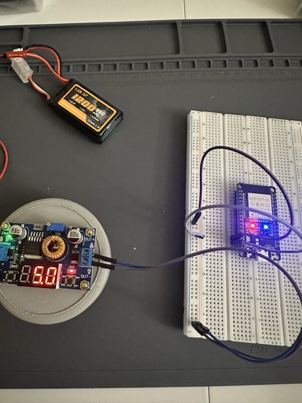

# Project Eragon

**A compact, mostly 3D-printed bipedal walking robot (~30 cm tall / 1 ft)** built as a hands-on robotics learning project.

Eragon is a small-scale biped designed to teach servo control, basic gait generation, balance feedback with IMU, and real-world mechanical/electrical integration — all while keeping the build affordable, beginner-friendly, and expandable.

## Progress
- Developing Electricity Notes
- **3D Printer Ready**
- Learning FreeCAD
- Developing End-to-End workflow
- Researching Simulation Software 
- Researching Bipedal Mechanics/Balance
- Learning C++
- Theorizing Python/C++ Combination Software (ESP32/Pi Crosstalk)
- Testing BOM components individually by breadboard for defects
<tr>
    <td align="center">
        
             <strong>Current Progress:</strong> Building/Programming ESP32
    </td>
</tr>

## License
MIT License — feel free to fork, modify, and build your own version!

Stay tuned — updates coming soon!

---
Project Eragon – because even short robots can be mighty.