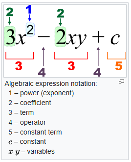

# Structure Notes
- This file will focus on the mechanical structure research for the production of Eragon

## Mathematics/Physics

### Quantity
- Refers to a **measurable property** of an object/system

### Magnitude
- Represents the **size or extent of a quantity**

### Scalar 
- mathematical and physical quantity that **only has a magnitude**
- Algebra

#### Algebra
- Studies the non-empty set of mathematical objects with algebraic operations
    

### Vector
- mathematical and physical quantity that has both **magnitude and *direction***
    - Mathematically displayed as a line of numbers
        - [ 1, 3, 5, 10, 20 ]  
    - Or in physics as a line with a magnitude
        - 20m ------->
- Vector Algebra

### Matrix
- A rectangular array of numbers
    - #### Rows
        - [1, 5, 67, 7, 8]
            - Horizontal
    - #### Columns
        - 2,
        - 4, 
        - 59, 
        - 1,
        - 9,
- Combine Rows/Columns for a matrix
    - Denoted as $m$(Rows) x $n$(Columns)
- Matrix Algebra

### Tensor
- Scalar, Vector and Matrix are all properties of Tensors
- Tensor Algebra

### Euclidean Geometry

#### End point
- A specific location

#### Line Segment
- a straight line bounded by two distinct endpoints
    - Contains all the points between them
- A **Line** extends infinitely in both directions, hence the addition of segment

#### Pythagorean Theorum
- 

#### Radius or Radii
- refers to the line segments form the center of a circle or sphere to it's perimeter

## Bipedal
- A form of terrestrial locomotion where an animal moves by means of its two rear legs
    - Raises the head
    - Greater field of vision
    - Allows non-locomotory limbs to be free for other uses.
- Types of Movement
    - Standing
    - Walking
    - Running
    - Jumping
    - Skipping

### Center of Mass
- Point where the body's mass is concentrated

### Base of Support
- Area defined by the feet on the ground

### Pivot point (aka Fulcrum)
- A specific location where a force causes rotation without the point itself moving. 
    - $\vec{\tau} = \vec{r} \times \vec{F}$
    

### Torque $T$
- Rotational equivalent of linear force. 
    - Quantification of the tendency of a force to cause or change the rotational motion of an object around a pivot point or axis

## Balance
- Countering gravitational forces, managing center-of-mass (CoM) and responding to perturbations in real-time
#### Static Balance
- Net forces and torques are zero

